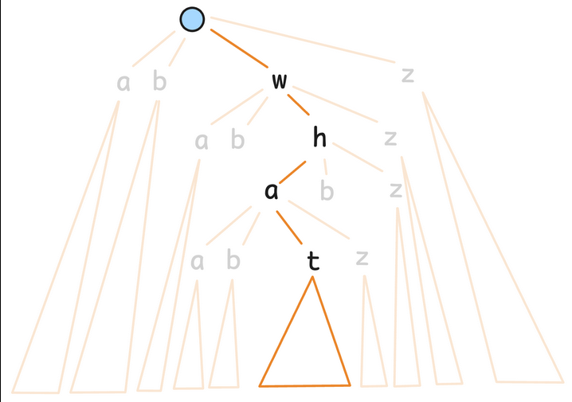
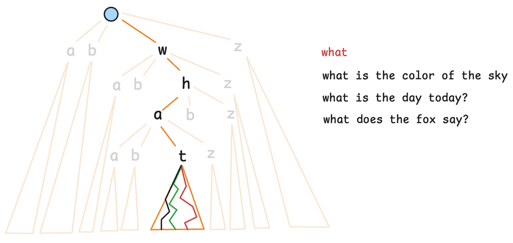
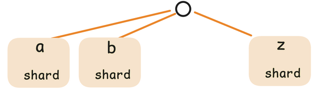
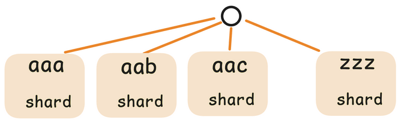

# High Level Design

## Trie Based Approach
We have a partial search query and we need to return the top 10 queries whose prefix matches the partial query. The goto for efficient prefix matching is a prefix tree or Trie. We can create a trie which contains all the search queries and the frequency of the query at the leaf node.

```go
type TrieNode struct {
	children  [63]*TrieNode // 63 = A-Z (26) + a-z (26) + 0-9 (10) + space (1)
	frequency int64         // frequency of search query
}
```

<div align="center" style="margin: 30px 0px;">
    
</div>

The problem with this approach is that tries are great when the data is static, meaning it will query the data in an optimal manner, but when adding a new query would take $O(n)$ time which is not fast enough because our workload is write heavy. Also since we need to get the top 10 values based on the frequency of each potential search query, we would have to iterate over every single query whose prefix matches the partial query, so essentially we are iterating over all queries whose prefix matches the partial query, there is no optimization done by the trie.

<div align="center" style="margin: 30px 0px;">
    
</div>

This problem can be solved by precomputing the top 10 results for every prefix of a query.

```go
type TrieNode struct {
	children    [63]*TrieNode // 63 = A-Z (26) + a-z (26) + 0-9 (10) + space (1)
	frequency   int64         // frequency of search query
	suggestions [10]string    // top 10 suggestions based on frequency
}
```

This would lead to much faster reads since the time complexity is now just $O(l)$. The writes would be slightly slow since on every search query, the suggestions need to be recalculated for every prefix.

### Sharding
Now the problem shifts to sharding the trie on multiple database servers. The challenge is to find a sharding key which has high cardinality and leads to even distribution of requests and data.

#### 1. First Character Of Query
Using the first character of the query leads to poor data distribution and low cardinality. Data distribution is poor due to some characters being used as the first character of queries way more frequently than others.

<div align="center" style="margin: 20px 0px;">
    
</div>

#### 2. First Three Characters Of Query
Using the first three characters of the query solves the low cardinality problem, but the issue of uneven data distribution persists and becomes worse, since now the distribution between keys like "why" and "xzi" is enormously different.

<div align="center" style="margin: 20px 0px;">
    
</div>

### Conclusion
There is no database which supports trie natively, so to implement this approach we would have to implement our own database from scratch which should not be the case for developing a MVP. The cons of a trie based approach overweight the pros. We need to think differently, what are we really doing with a trie?

## Key Value Store Based Approach
> In the trie based approach, we are essentially storing the top 10 sugggestions for every possible prefix of the search query. We do not need a trie for that, we can also use a key value data store where the key is one of the prefixes and the value is the top 10 suggestions to show for that prefix.

## Schema

**Top Suggestions DB Schema (Cache)**
| Prefix | Top K Suggestions |
|---------|---------|
| `wha` | what is 2+2  => 10000<br>what is the color of the sky => 5000<br>what does the fox say => 2000 |
| `what i` | what is 2+2 => 10000<br>what is the color of the sky => 5000<br>what is the day today => 1000 |
| `what d` | what does the fox say => 2000<br>what does a fox eat => 1900 |

All possible prefixes that our system will show suggestions, it will already store all the precomputed top k suggestions.

## Sharding
Sharding is done using **consistent hashing**. Hash the partial query provided by the user to create a pseudo random integer and place it on the ring and then move clockwise until you hit a virtual node, which is the key-value store containing the top k suggestions for that prefix.

Consistent hashing ensures even distribution of prefixes.

## Batching

There are going to be a lot of updates to the Top Suggestions DB because every search query leads to 10 writes, one for each prefix. This means there are going to be 200,000 searches / second * 10 = 2 million writes per second. To reduce the number of writes to the cache (Top Suggestions DB) we need to implement batching.

The key idea of batching is lazily updating the cache, say every time the frequency of a search query becomes a multiple of a batch_size, say 1000, only then we go ahead and update all the prefixes of the search queries in the cache.

**Before batching**: 200,000 (frequency db) + 200,000 * 10 (suggestions db) = **2.2 Million writes / second** <br/>
**After batching**: 200,000 (frequency db) + 200,000 * 10 / 1000 (suggestions db) = **202,000 writes / second**
